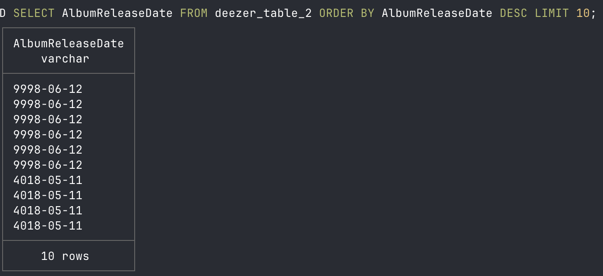

# Some issues during my deezer adventure

## Music from Beyond & BC Music

I found out that for some rows, AlbumReleaseDate field is totally wrong, showing inexistent years. .
I first believed this happened when I created uploaded all data into an empty table on duckdb where datatypes were already defined, but had to convert some fields to varchar datatype.
I found out also that by doing the below, same error is still there
```sql
SELECT *
FROM read_csv_auto('./extracted/deezer_flat.csv', SAMPLE_SIZE =-1);
```
Then, I coded this AlbumReleaseDate_check script to verify if this field already had this odd album release dates from the beggining (csv file extracted), and yes it did!. However, after some research I found out that this is not uncommon. Actually, the odd dates could be intentional fake dates used by data producers (like music APIs, CRMs, or content systems) for some cases, e.g. when the actual release date isn’t finalized yet (“coming soon”), the record is in a staging or test environment.

The query below showed that from the initial 119,500,260 rows, 119,489,917 had an album release date between 1800 and 2025. I decided to work only with this bits. I updated the dashboard to use only this portion of the total records, which represents almost 100%
I used this same query to crete a deezer_table2 in order to work only with those records

```sql
SELECT AlbumReleaseDate
FROM deezer_table
WHERE CAST(SUBSTRING(AlbumReleaseDate,1,4) AS INT) BETWEEN 1800 AND 2025
ORDER BY CAST(SUBSTRING(AlbumReleaseDate,1,4) AS INT) ASC;
```
